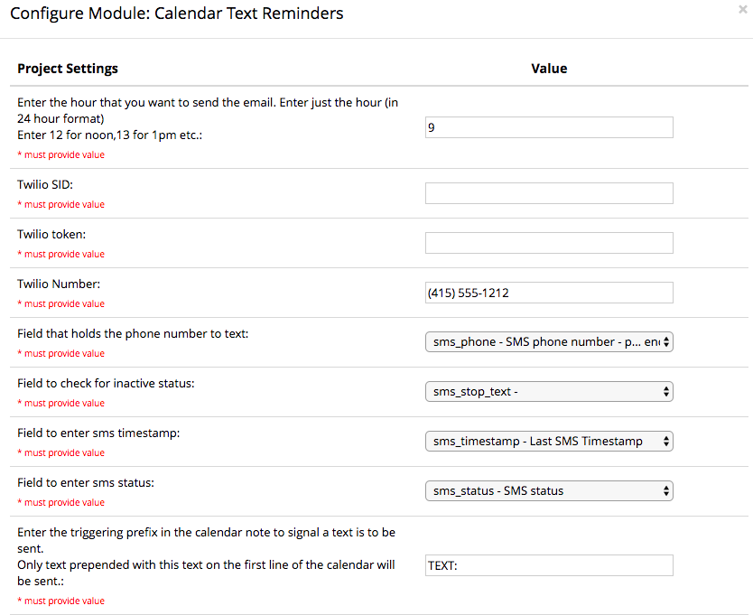
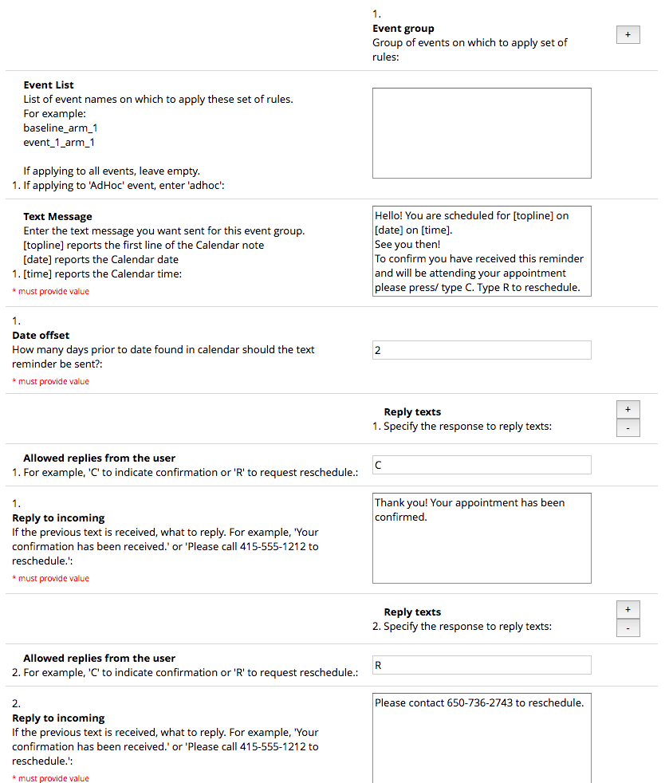
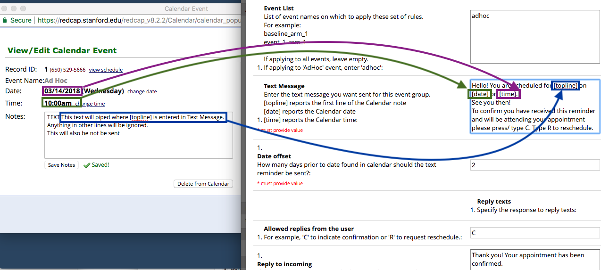

# redcap-em-calendar-text-reminders
Send SMS to remind participants about upcoming appointments found in calendar.

- Enter the hour that you want the text sent
- Enter your Twilio credentials. 
  - Twilio SID
  - Twilio token
  - Twilio phone number

- Specify the fields in REDCap to set up information on the text recipient and for logging status on the text attempt. You can select existing fields, or you can use the convenience form attached here.  
  - sms_phone - phone number to text 
  - sms_stop_text - to stop further texting
  - sms_timestamp - timestamp of last text
  - sms_status - log of last text
  
- Enter the triggering prefix in the calendar note to signal a text is to be sent.
  Only text prepended with this text on the first line of the calendar will be sent.
  
  In this example, texts will only be sent if prepended with "TEXT:".

  
Configure the texting parameters. These define how the texts should be sent. You can configure the parameters around groups of calendar events.
Event List
List of all event names which should receive texts

For example, if you wanted to send for two events, enter them both on separate lines.

For the 'Ad Hoc' schedule  (those added through the Calendar are designated to an "ad hoc" event), enter the string 'adhoc'.
>event_1_arm_1

>event_2_arm_2

>adhoc

Leave blank to apply to all events

Text Message - Enter the body of the text message here.  There are a few 'piped' fields that can be incorporated into your text message
- [topline] - The first line of your Calendar note. You can specify the appointment type and location so that it can be included in the text.
- [date] - The date of the Calendar appointment
- [time] - The time of the Calendar appointment  
  

